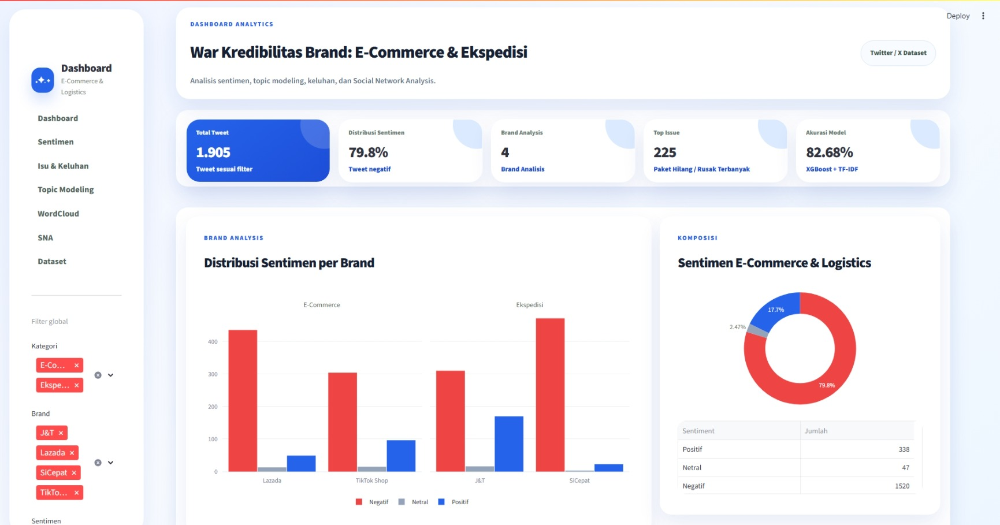
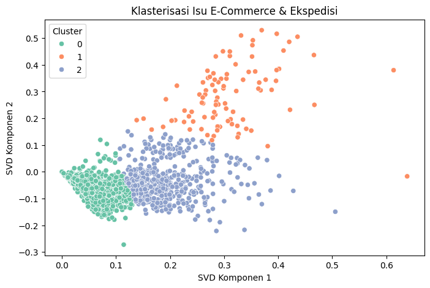
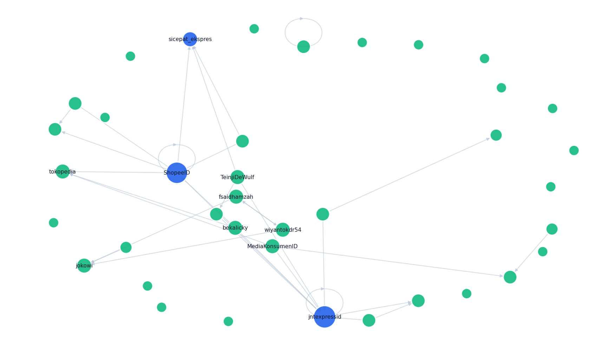
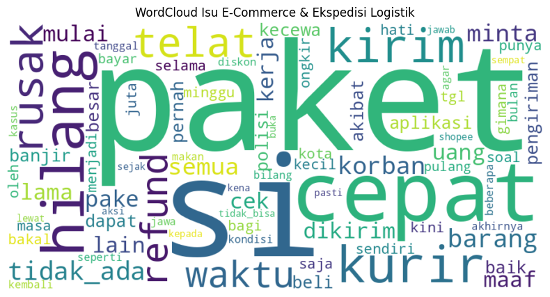

# Social Media Sentiment Analysis Dashboard for E-Commerce & Logistics

An end-to-end social media sentiment analysis project on **1,905 tweets** related to e-commerce and logistics services. This project applies Natural Language Processing (NLP), Machine Learning, Social Network Analysis (SNA), and BERTopic to extract sentiment, discussion topics, and interaction patterns, presented through an interactive Streamlit dashboard.

---

## Features

- Sentiment analysis using Logistic Regression
- Text preprocessing and TF-IDF feature extraction
- Topic modeling with BERTopic
- Social Network Analysis (SNA)
- Interactive Streamlit dashboard
- Data visualization for sentiment and discussion trends

---

## Tech Stack

- Python
- Pandas
- Scikit-learn
- BERTopic
- Streamlit
- NetworkX
- Matplotlib
- Google Colab

---

## Project Structure

```
social-media-sentiment-analysis-dashboard
│
├── app/
│   └── app.py
├── data/
├── notebooks/
├── screenshots/
├── README.md
├── requirements.txt
└── LICENSE
```

---

## 📸 Dashboard Preview

### Dashboard



### Topic Clustering



### Social Network Analysis



### Word Cloud



---

## Project Highlights

- Analyzed **1,905 social media tweets** related to e-commerce and logistics services.
- Applied NLP techniques for sentiment classification.
- Identified discussion topics using BERTopic.
- Explored account interaction patterns through Social Network Analysis (SNA).
- Built an interactive dashboard using Streamlit for data visualization.

---

Information Systems Student at Universitas Budi Luhur
